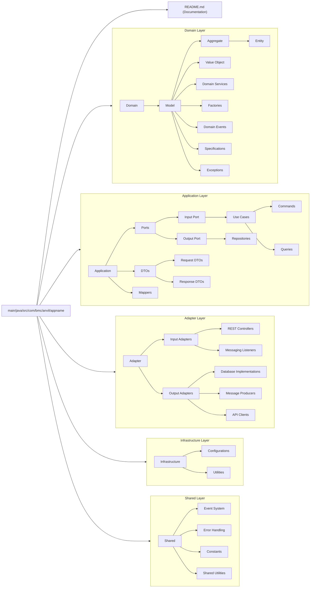

# Folder structure

## Tree View

```
src/
├── main/
│   ├── java/
│   │   ├── com/
│   │   │   └── example/
│   │   │       └── appname/
│   │   │           ├── domain/             # Domain Layer: Business Logic Core
│   │   │           │   ├── model/               # Domain Models (Aggregates, Entities, Value Objects)
│   │   │           │   │   ├── aggregate/           # Aggregates: Root entities managing groups of entities
│   │   │           │   │   ├── entity/              # Entities: Non-root Entities (Shared or Included in Aggregates) / Domain objects with unique identity
│   │   │           │   │   └── valueobject/         # Value Objects: Immutable domain objects (no identity)
│   │   │           │   ├── factory/             # Factories: Centralized creation logic for domain objects (Instantiate Aggregates / Entities)
│   │   │           │   ├── service/             # Domain Services: Express core business logic (Business Logic Across Aggregates / Entities)
│   │   │           │   ├── event/               # Domain Events: Track State Changes or occurrences in the domain
│   │   │           │   ├── specification/       # Specifications: Domain validations rules
│   │   │           │   └── exception/           # Exceptions: Domain-specific errors or rule violations
│   │   │           ├── application/        # Application Layer: Orchestrates use cases and workflows (application Logic, Core Use Cases)
│   │   │           │   ├── port/                # Ports: Define boundaries for use cases
│   │   │           │   │   ├── in/                  # Input Ports: Interfaces for incoming requests (Use Cases)
│   │   │           │   │   └── out/                 # Output Ports: Interfaces for external resources/services (repositories, API gateways)
│   │   │           │   │       └── repositories/        # Repositories interfaces: db interfaces
│   │   │           │   ├── use_case/             # Use Case Implementations: Application logic for workflow
│   │   │           │   │   ├── command/             # Command Handlers: Handle state-changing (write logic) operations (can be a handler folder in case commands themselves are different from requestDTOs)
│   │   │           │   │   └── query/               # Query Handlers: Handle read-only operations
│   │   │           │   ├── dto/                 # DTOs: Data Transfer Objects for communication
│   │   │           │   │   ├── request/             # Request DTOs: Represent incoming user input
│   │   │           │   │   └── response/            # Response DTOs: Represent outgoing data
│   │   │           │   └── mapper/              # Mappers: Translate between domain and DTO objects
│   │   │           ├── adapter/            # Adapter Layer: Interfaces with external systems (Controllers, API Clients, DBs, Storage, Brokers, etc.)
│   │   │           │   ├── in/                  # Input Adapters: Accept data into the application
│   │   │           │   │   ├── rest/                # REST Controllers: Handle HTTP requests
│   │   │           │   │   └── messaging/           # Messaging Brokers listeners: Kafka, RabbitMQ, etc.
│   │   │           │   ├── out/                 # Output Adapters: Implement external integrations
│   │   │           │   │   ├── database/            # Implementation for database repositories
│   │   │           │   │   ├── messaging/           # Messaging Brokers producers: Kafka, RabbitMQ, etc.
│   │   │           │   │   ├── api/                 # External APIs: API clients to other systems
│   │   │           ├── infrastructure/     # Infrastructure Layer: Framework and driver concerns
│   │   │           │   ├── config/                  # Configurations: Frameworks and system setup ()
│   │   │           │   └── util/                    # Utilities: Shared infrastructure-specific helpers (logging, security, jwt, datetime, etc)
│   │   │           └── shared/                  # Shared Layer: Cross-cutting reusable components
│   │   │               ├── event/                   # Shared Event System: Publish/Subscribe events
│   │   │               ├── error/                   # Error Handling: Global and reusable exceptions
│   │   │               ├── constants/               # Shared Constants: Application-wide static values
│   │   │               └── utils/                   # Common Utilities: Helper classes and shared logic
│
└── README.md                               # Main ReadMe describing the project structure
```

## Diagram View


